## Instalação e Configuração do Moodle

<p>Instalação de pacotes necessários</p>

    apt install -y graphviz aspell ghostscript clamav git

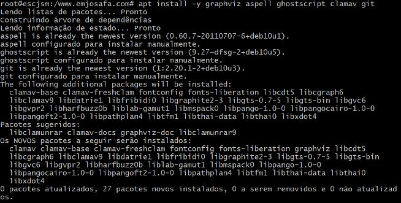

<p>Instalação do mariadb</p>

    apt install -y mariadb-server mariadb-client

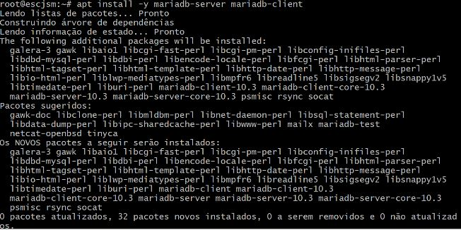

<p>Instalação do webserver Apache com o suporte php</p>

    apt install -y apache2 php libapache2-mod-php php-cli php-mysql php-mbstring php-xmlrpc php-zip

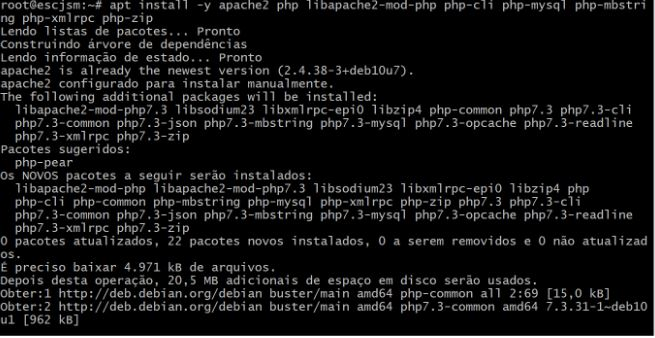

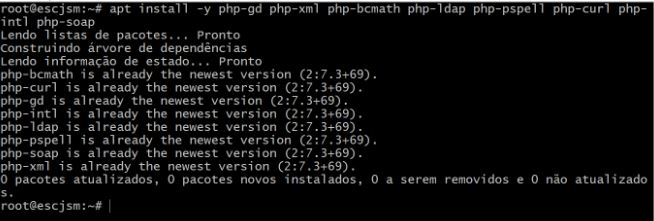

<p>Reiniciar o serviço apache</p>

``` systemctl restart apache2 ```

#### Criação de um diretório para baixar o moodle

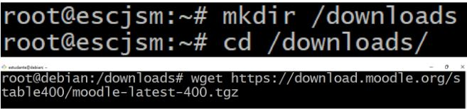

#### Configurações

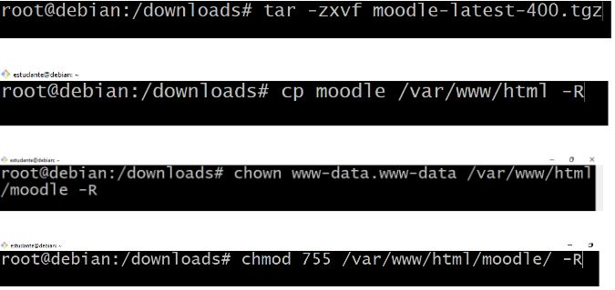

#### Criando banco de dados e usuário no mariadb

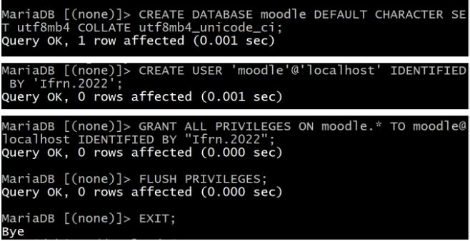

>```rm /var/www/html/index.html ```
>
>```chmod 777 /var/www ```


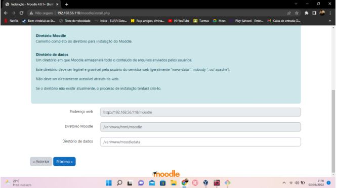


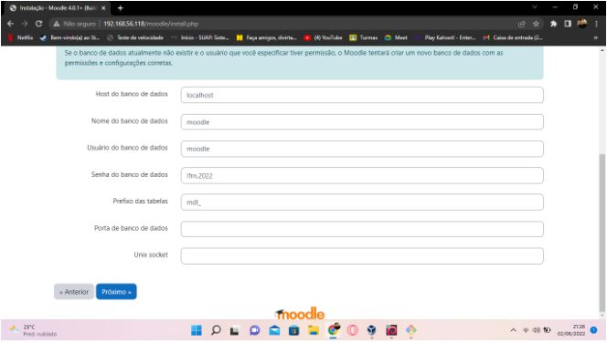

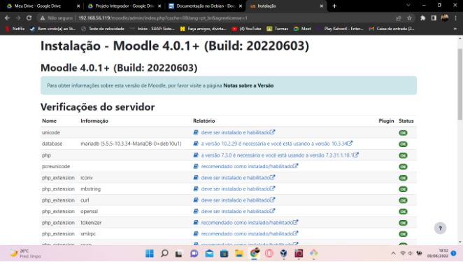

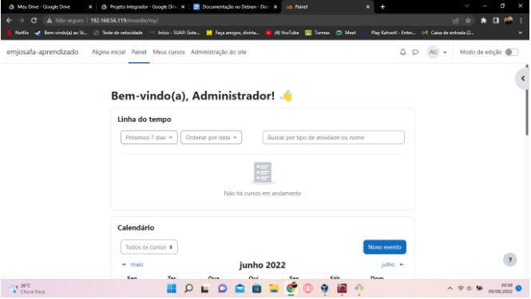

``` chmod 777 /var/www ```

