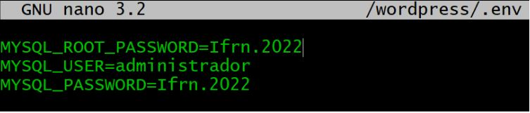
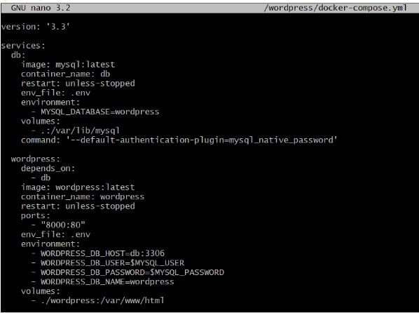
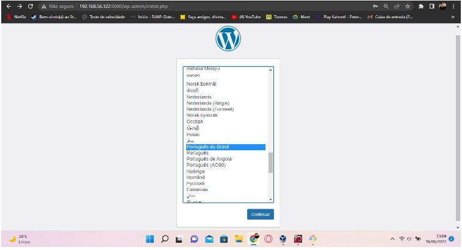
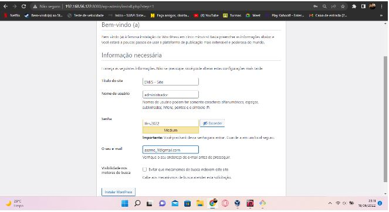
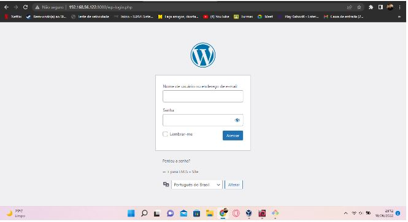

## Instalação do Wordpress via Docker no Debian

` apt install -y docker.io docker-compose `

##### Criando um diretório

` mkdir /wordpress `

#### Configura do arquivo .env
` nano wordpress/.env `

#### configurando o arquivo docker-compose.yml

` nano /wordpress/docker-compose.yml `

### Páginas Iniciais do Wordpress

